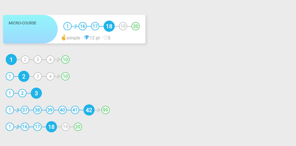

## React-Stepper 🍭

An horizontal line of steps, with (optional) step compression. Four distinct states for each step:
selected, done, undone, last step. Minimal react-component, no-dependencies.



### Installation and Usage

` yarn add react_stepper`

or

` npm install react_stepper --save`

A stepper code example:

` import Stepper from "react-stepper" `


`<Stepper maxSteps={5} steps={10} selected={1} /> `


Props

* steps: [Required] Integer - Number of steps. Integer >= 2
* selected: [Optional] Integer - Current step. Integer in [1, steps]
* maxSteps: [Optional] Integer - Maximum number of steps. Will compress the steps. Integer in [3, steps]
* colors: [Optional] Object - A style object to define the different states colors of the circles.

`colors` style object properties:

```
const CIRCLE_COLORS = {
  DONE: {
    border: '#25BCEB',
    background: '#ffffff',
    font: '#25BCEB'
  },
  UNDONE: {
    border: '#C7C7C7',
    background: '#ffffff',
    font: '#C7C7C7'
  },
  LAST: {
    border: '#60D172',
    background: '#ffffff',
    font: '#60D172'
  },
  CURRENT: {
    border: '#25BCEB',
    background: '#25BCEB',
    font: '#ffffff'
  }
}
```

Feel free to fork, use and modify.
